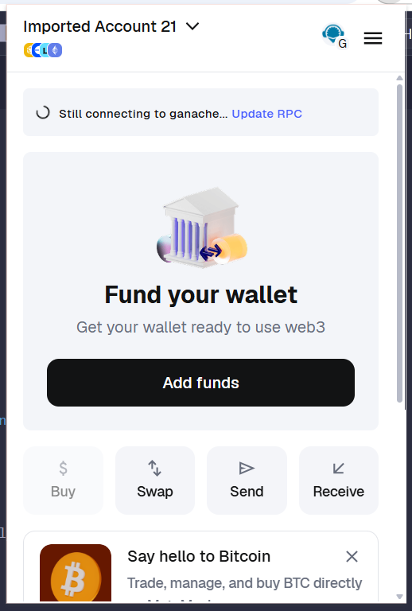
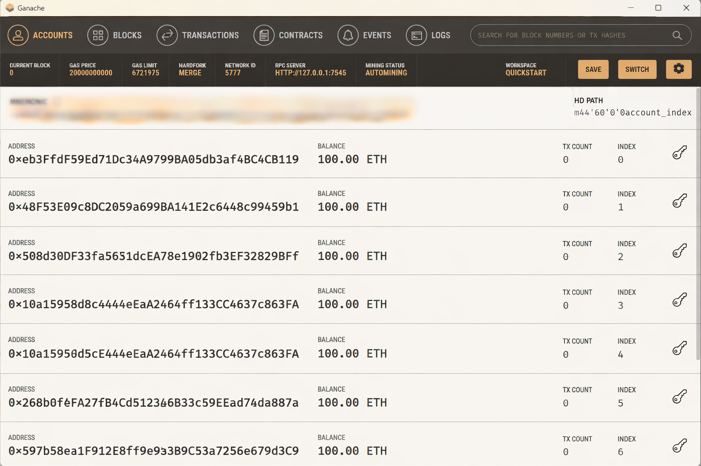

# Carbon on the Chain 🌍

Blockchain-based Carbon Credit Ecosystem using Ethereum Smart Contracts and MetaMask.

## 🚀 Live Demo
https://ganaeg.github.io/Carbon-on-the-Chain-Digital-Solutions-for-a-Greener-Planet/

## 🛠 Technologies Used
- Solidity
- Ethereum
- Ganache
- MetaMask
- Ethers.js
- HTML, CSS, JavaScript

## 🔐 Features
- NFT-based Industry Certification (ERC-721)
- ERC-20 Carbon Credit Token
- Cap-and-Trade Mechanism
- Auditor Verification System
- Carbon Credit Trading
- Dashboard Analytics
  
## 🦊 MetaMask + Ganache Setup
Smart contracts were tested locally using Ganache and connected through MetaMask.

## 🧪 Ganache Local Blockchain

Smart contracts were tested locally using Ganache before deploying to a public testnet.

## 📄 Project Report
Available in this repository.
